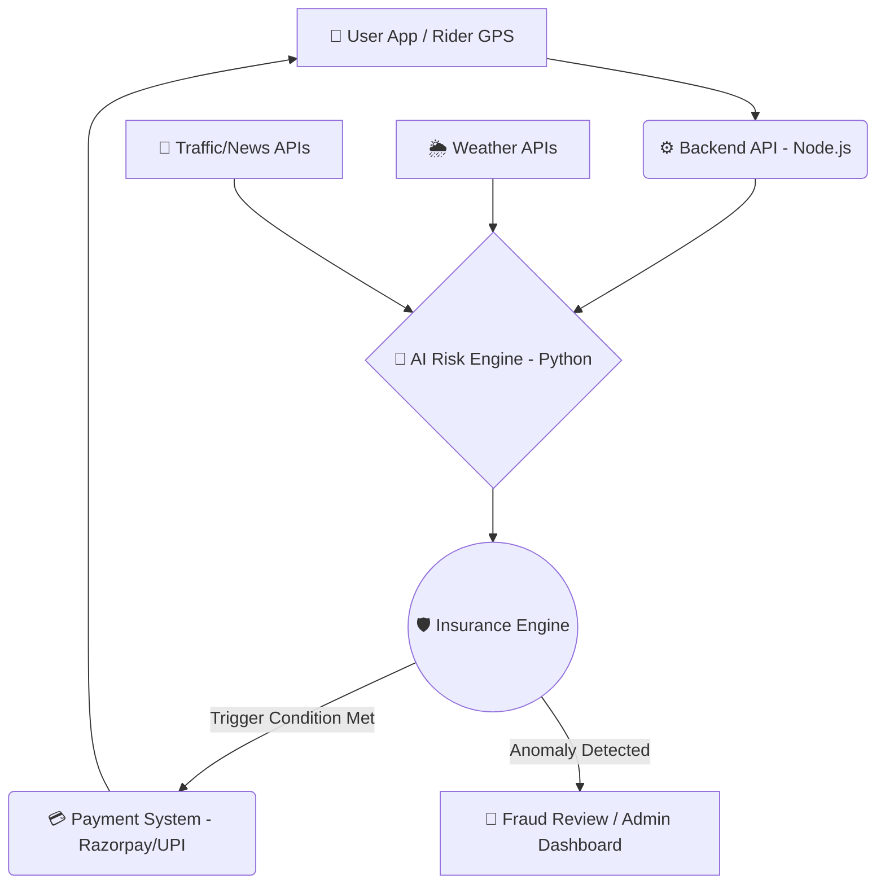

# 🛵 ShiftSafe-DT: AI-Powered Income Protection for Delivery Partners
**Phase 1: Ideation & Foundation — "Ideate & Know Your Delivery Worker"**

*An AI-enabled parametric micro-insurance platform empowering platform-based delivery partners against uncontrollable income loss.*

---

## ⚠️ Scope & Critical Constraints
- **Coverage Scope**: **Strictly LOSS OF INCOME ONLY.** The platform provides a financial safety net for lost wages due to external disruptions. It explicitly **excludes** coverage for health, life, accidents, or vehicle repairs.
- **Financial Model**: 100% **Weekly pricing basis** to perfectly match the payout cycle and cash flow of gig workers.

---

## 👥 1. Persona & Sub-Category Focus
**Sub-Category**: Food Delivery Partners (e.g., Zomato, Swiggy)

**Persona Strategy**:
Meet Ravi, a 32-year-old Food Delivery Partner in Mumbai. Ravi earns roughly ₹4,000 to ₹5,000 per week. He lives week-to-week and relies heavily on peak hours (lunch and dinner rushes). Any disruption during these hours severely impacts his weekly livelihood. When uncontrollable external disruptions occur, Ravi currently bears the full financial loss. ShiftSafe-DT is built to protect Ravi.

---

## 🌪️ 2. Core Disruptions & Parametric Triggers Defined (100% Automated)

To avoid the mistake of manual claims, we define specific **External Disruptions** that act as our parametric triggers for **automated payouts**:

| Event | Trigger | Source API/Data | Automation Logic |
| :--- | :--- | :--- | :--- |
| **Heavy Rain & Flooding** | Rainfall > 50mm in a 2-hour window | OpenWeatherMap API | Automatic payout if GPS shows user in affected zone. |
| **Extreme HeatWaves** | Temperature > 42°C for 3+ consecutive hours | OpenWeatherMap / IMD API | Triggered for peak shift hours (Lunch/Dinner). |
| **Severe Pollution** | AQI > 450 (Severe+) restricting visibility | AQICN API | Auto-claim initiated based on real-time AQI health warnings. |
| **Platform Outages** | Aggregator server down > 90 minutes | Downdetector / Direct Ping | Verified against external outage logs. No user input needed. |
| **Unplanned Curfews** | Sudden zone closures/Section 144 | Government API / News Scraper | Triggered via geo-fencing the closed zones. |

---

## 🏗️ 3. System Architecture (Optimized for Automation & Speed)

ShiftSafe-DT is built on a robust, event-driven architecture designed to minimize latency and ensure zero-touch automated claims.

---

## 🔄 4. Requirement Details & Zero-Touch Workflow

**Scenario: The Unforgiving Monsoon (Heavy Rain Trigger)**
*   **The Context:** An unseasonal downpour hits Ravi's operational zone in Mumbai just before the dinner rush. Delivering safely is impossible. He loses 30% of his daily earnings.
*   **The 100% Automated Workflow:**
    1.  **Monitoring:** ShiftSafe-DT's backend continuously monitors the Weather API—**Ravi doesn't even need to open the app.**
    2.  **Activation:** The API registers > 50mm of rainfall. The parametric condition for "Heavy Rain" is met.
    3.  **Validation:** AI clarifies Ravi's active policy and verifies his GPS location trail to ensure he was actually working during the disruption.
    4.  **Instant Payout:** A predefined income-replacement payout is instantly credited to Ravi's registered account (via UPI). 
*   **Zero-Claim UX:** Ravi receives a notification: *"Heavy rain detected in your zone. ₹250 has been credited to your wallet for missed earnings."* **No manual claim filing, no proof of loss required.**

---

## 💰 5. The Weekly Premium Model

Gig workers operate on weekly cash flows. ShiftSafe-DT aligns with their financial reality through a **Weekly Micro-Premium Model**.

*   **Granular Payments:** Premiums are broken down into manageable weekly deductions (e.g., ₹15 - ₹25/week).
*   **Synchronized Deductions:** Premiums are automatically deducted on the same day aggregator platforms process their weekly payouts, ensuring the worker never feels a cash crunch.
*   **Dynamic Adjustments (Focused AI):** The weekly premium is not static. AI adjusts it based on local risk, ensuring the system remains affordable yet solvent.

---

## 🧠 6. Practical AI & ML Integration Strategy
*We avoid over-complicated AI by focusing on two high-impact, practical use cases.*

*   **1. Dynamic Premium Pricing (Predictive Risk Modeling):**
    *   **Goal:** Calculate fair premiums.
    *   **How it works:** Machine Learning (Regression/XGBoost) predicts the probability of a trigger event for the upcoming week based on historical patterns.
*   **2. Intelligent Fraud Detection (Anomaly Detection):**
    *   **Goal:** Prevent GPS spoofing and duplicate claims WITHOUT slowing down genuine users.
    *   **How it works:** Unsupervised ML (Isolation Forests) monitors user behavior (typical route logic, speed, login consistency) to ensure the rider was actually in the disaster zone.

---

## 💻 7. Premium UI Prototype & Demo Focus

*Note: For Phase 1, we focus on a High-Utility, Clean Mobile UI to avoid the "Bad UI" pitfall.*

**Core Screens & Demo Walkthrough:**
1.  **Signup/Onboarding:** 10-second verification.
2.  **Intuitive Dashboard:** A "Protection Shield" visual showing active weekly coverage and current risk level.
3.  **One-Click Policy:** Transparent weekly pricing with zero hidden terms.
4.  **Live Claim Demo:** A simulated phone notification showcasting the **Auto-Payout sequence** (Disruption Detected -> Payout Triggered -> Money in Bank).

---

## � 8. UI Prototype — High-Fidelity Screens

> *Mobile-first, dark-mode design built for real delivery partners. Every screen is crafted to be intuitive, fast, and actionable.*

| 🔐 Frictionless Signup | 🛡️ Live Dashboard | 📋 Claim Status |
|:---:|:---:|:---:|
|  |  |  |
| **1-minute onboarding** via mobile OTP — Zero paperwork, instant verification. | **Active Coverage + Zone Risk** visualized in real-time. Protected earnings & pending claims at a glance. | **Push notification history** showing automated payout trail — Heavy Rain → ₹100 Credited instantly. |

**Design Principles:**
- 🌑 **Dark Mode First** — Optimized for outdoor use in low-light conditions
- ⚡ **Zero-Touch UX** — Riders are notified & paid without opening the app
- 📊 **Risk-Aware Dashboard** — Live zone risk radar with moderate/high/severe indicators
- 🔔 **Transparent Claim Trail** — Every automated payout logged with Claim ID for trust

---

## �🔗 9. Phase 1 Deliverables Links

*   **GitHub Repository:** [https://github.com/anshika1179/ShiftSafe-DT](https://github.com/anshika1179/ShiftSafe-DT)
*   **Phase 1 Strategy & Prototype Video:** [▶️ Watch Demo](https://youtu.be/Dlwt3ch3y5A) *(Focus: Showing the end-to-end automated claim flow)*

---

  <i>Built to solve, not just to show. Zero-touch protection for the gig economy.</i>

