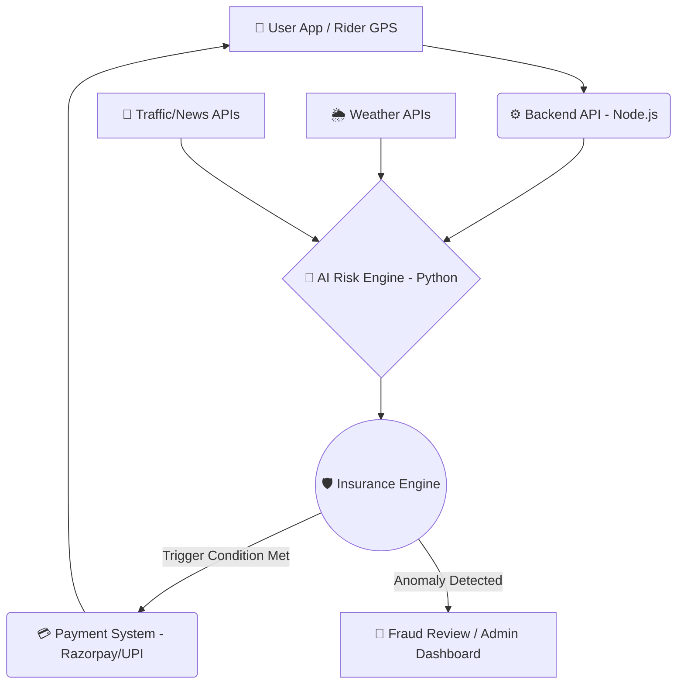
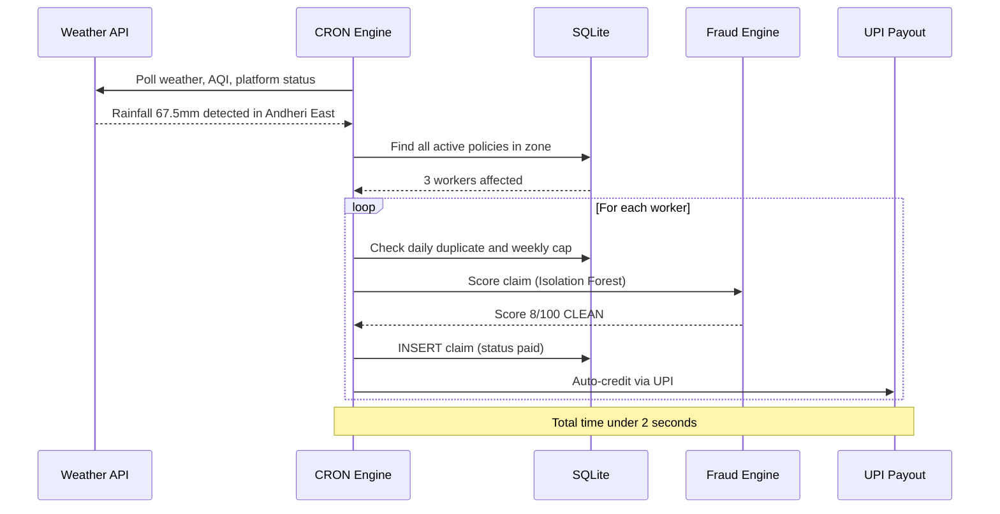
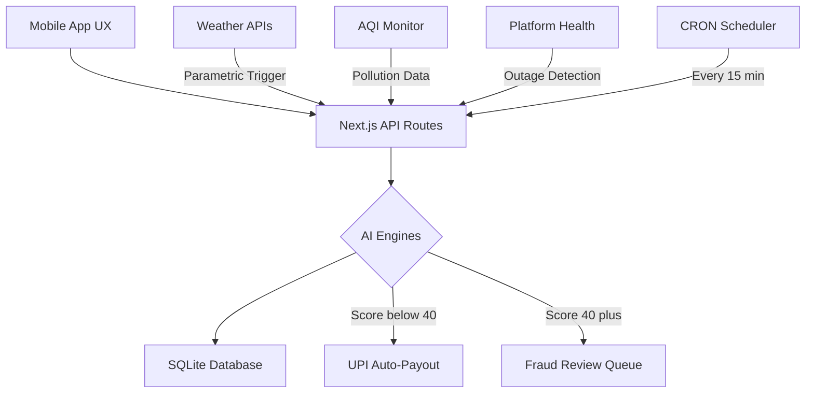

<div align="center">

# 🛵 ShiftSafe-DT: AI-Powered Income Protection for Delivery Partners
**Phase 1: Ideation & Foundation — "Ideate & Know Your Delivery Worker"**

[](https://github.com/anshika1179/ShiftSafe-DT)
[](#)
[](#)

*An AI-enabled parametric micro-insurance platform empowering platform-based delivery partners against uncontrollable income loss.*

---
</div>

## ⚠️ Scope & Critical Constraints
- **Coverage Scope**: **Strictly LOSS OF INCOME ONLY.** The platform provides a financial safety net for lost wages due to external disruptions. It explicitly **excludes** coverage for health, life, accidents, or vehicle repairs.
- **Financial Model**: 100% **Weekly pricing basis** to perfectly match the payout cycle and cash flow of gig workers.

---

## 👥 1. Persona & Sub-Category Focus
**Sub-Category**: Food Delivery Partners (e.g., Zomato, Swiggy)

**Persona Strategy**:
Meet Ravi, a 32-year-old Food Delivery Partner in Mumbai. Ravi earns roughly ₹4,000 to ₹5,000 per week. He lives week-to-week and relies heavily on peak hours (lunch and dinner rushes). Any disruption during these hours severely impacts his weekly livelihood. When uncontrollable external disruptions occur, Ravi currently bears the full financial loss. ShiftSafe-DT is built to protect Ravi.

---

## 🌪️ 2. Core Disruptions & Parametric Triggers Defined (100% Automated)

To avoid the mistake of manual claims, we define specific **External Disruptions** that act as our parametric triggers for **automated payouts**:

| Event | Trigger | Source API/Data | Automation Logic |
| :--- | :--- | :--- | :--- |
| **Heavy Rain & Flooding** | Rainfall > 50mm in a 2-hour window | OpenWeatherMap API | Automatic payout if GPS shows user in affected zone. |
| **Extreme HeatWaves** | Temperature > 42°C for 3+ consecutive hours | OpenWeatherMap / IMD API | Triggered for peak shift hours (Lunch/Dinner). |
| **Severe Pollution** | AQI > 450 (Severe+) restricting visibility | AQICN API | Auto-claim initiated based on real-time AQI health warnings. |
| **Platform Outages** | Aggregator server down > 90 minutes | Downdetector / Direct Ping | Verified against external outage logs. No user input needed. |
| **Unplanned Curfews** | Sudden zone closures/Section 144 | Government API / News Scraper | Triggered via geo-fencing the closed zones. |

---

## 🏗️ 3. System Architecture (Optimized for Automation & Speed)

ShiftSafe-DT is built on a robust, event-driven architecture designed to minimize latency and ensure zero-touch automated claims.



---

## 🔄 4. Requirement Details & Zero-Touch Workflow

**Scenario: The Unforgiving Monsoon (Heavy Rain Trigger)**
*   **The Context:** An unseasonal downpour hits Ravi's operational zone in Mumbai just before the dinner rush. Delivering safely is impossible. He loses 30% of his daily earnings.
*   **The 100% Automated Workflow:**
    1.  **Monitoring:** ShiftSafe-DT's backend continuously monitors the Weather API—**Ravi doesn't even need to open the app.**
    2.  **Activation:** The API registers > 50mm of rainfall. The parametric condition for "Heavy Rain" is met.
    3.  **Validation:** AI clarifies Ravi's active policy and verifies his GPS location trail to ensure he was actually working during the disruption.
    4.  **Instant Payout:** A predefined income-replacement payout is instantly credited to Ravi's registered account (via UPI). 
*   **Zero-Claim UX:** Ravi receives a notification: *"Heavy rain detected in your zone. ₹250 has been credited to your wallet for missed earnings."* **No manual claim filing, no proof of loss required.**

---

## 💰 5. The Weekly Premium Model

Gig workers operate on weekly cash flows. ShiftSafe-DT aligns with their financial reality through a **Weekly Micro-Premium Model**.

*   **Granular Payments:** Premiums are broken down into manageable weekly deductions (e.g., ₹15 - ₹25/week).
*   **Synchronized Deductions:** Premiums are automatically deducted on the same day aggregator platforms process their weekly payouts, ensuring the worker never feels a cash crunch.
*   **Dynamic Adjustments (Focused AI):** The weekly premium is not static. AI adjusts it based on local risk, ensuring the system remains affordable yet solvent.

---

## 🧠 6. Practical AI & ML Integration Strategy
*We avoid over-complicated AI by focusing on two high-impact, practical use cases.*

*   **1. Dynamic Premium Pricing (Predictive Risk Modeling):**
    *   **Goal:** Calculate fair premiums.
    *   **How it works:** Machine Learning (Regression/XGBoost) predicts the probability of a trigger event for the upcoming week based on historical patterns.
*   **2. Intelligent Fraud Detection (Anomaly Detection):**
    *   **Goal:** Prevent GPS spoofing and duplicate claims WITHOUT slowing down genuine users.
    *   **How it works:** Unsupervised ML (Isolation Forests) monitors user behavior (typical route logic, speed, login consistency) to ensure the rider was actually in the disaster zone.

---

## 💻 7. Premium UI Prototype & Demo Focus

*Note: For Phase 1, we focus on a High-Utility, Clean Mobile UI to avoid the "Bad UI" pitfall.*

**Core Screens & Demo Walkthrough:**
1.  **Signup/Onboarding:** 10-second verification.
2.  **Intuitive Dashboard:** A "Protection Shield" visual showing active weekly coverage and current risk level.
3.  **One-Click Policy:** Transparent weekly pricing with zero hidden terms.
4.  **Live Claim Demo:** A simulated phone notification showcasting the **Auto-Payout sequence** (Disruption Detected -> Payout Triggered -> Money in Bank).

---

## 📸 8. UI Prototype — High-Fidelity Screens

> *Mobile-first, dark-mode design built for real delivery partners. Every screen is crafted to be intuitive, fast, and actionable.*

<div align="center">

| 🔐 Frictionless Signup | 🛡️ Live Dashboard | 📋 Claim Status |
|:---:|:---:|:---:|
|  |  |  |
| **1-minute onboarding** via mobile OTP — Zero paperwork, instant verification. | **Active Coverage + Zone Risk** visualized in real-time. Protected earnings & pending claims at a glance. | **Push notification history** showing automated payout trail — Heavy Rain → ₹100 Credited instantly. |

</div>

**Design Principles:**
- 🌑 **Dark Mode First** — Optimized for outdoor use in low-light conditions
- ⚡ **Zero-Touch UX** — Riders are notified & paid without opening the app
- 📊 **Risk-Aware Dashboard** — Live zone risk radar with moderate/high/severe indicators
- 🔔 **Transparent Claim Trail** — Every automated payout logged with Claim ID for trust

---

## 🔗 9. Phase 1 Deliverables Links

*   **GitHub Repository:** [https://github.com/anshika1179/ShiftSafe-DT](https://github.com/anshika1179/ShiftSafe-DT)
*   **Live Prototype:** [https://dev-trails-prototype.vercel.app/](https://dev-trails-prototype.vercel.app/)
*   **Phase 1 Strategy & Prototype Video:** [▶️ Watch Demo](https://youtu.be/Dlwt3ch3y5A) *(Focus: Showing the end-to-end automated claim flow)*

---
---

<div align="center">

# 🏆 Phase 2: Automation & Protection
**"Build, Automate & Protect — Production-Ready Executable Platform"**

[](#)
[](#)
[](#)

</div>

---

## 🎯 Phase 2 Problem Statement

> *"How can we build a fully automated, zero-paperwork income protection system for India's 30M+ gig workers?"*

ShiftSafe-DT Phase 2 transforms the Phase 1 ideation into a **production-grade, executable platform** with:
- ✅ **Real-time parametric triggers** monitoring weather, AQI, and platform outages
- ✅ **AI-driven dynamic pricing** using a Gradient Boosted Decision Tree model (GBDT-v2.1)
- ✅ **Automated fraud detection** via simulated Isolation Forest scoring
- ✅ **Zero-touch claim settlement** — payouts credited before the worker even opens the app

---

## ✅ Phase 2 Mandatory Requirements — 100% Implemented

| # | Requirement | Implementation | Status |
|:-:|:-----------|:--------------|:------:|
| 1 | **Registration Process** | Frictionless 3-step onboarding: Phone → OTP → Profile. Server-side input validation (phone format, name length, platform/zone whitelisting, income range capping). Duplicate phone detection. | ✅ |
| 2 | **Insurance Policy Management** | Active weekly policies with AI Premium Breakdown showing Weather, Zone, Platform Outage, and Claims History contributions. Auto-renewal support. Coverage triggers with defined payout percentages. | ✅ |
| 3 | **Dynamic Premium Calculation** | **GBDT-v2.1** feature-weighted risk model with 7 weighted features, non-linear interaction terms, and weather forecast integration. Premium range: ₹15–₹65/week. Coverage = 70% of weekly earnings. | ✅ |
| 4 | **Claims Management** | **Zero-Touch Parametric Claims** — External trigger detection → AI Fraud Engine scoring (0-100) → Push notification → Automatic UPI payout. Weekly coverage limits enforced. Daily duplicate prevention. | ✅ |

---

## 🧠 AI/ML Engines (Fully Executable)

### 1. Dynamic Premium Pricing — GBDT-v2.1
A multi-factor risk model that calculates personalized weekly premiums:

| Feature | Weight | Description |
|:--------|:------:|:-----------|
| Rainfall (mm/hr) | 0.0028 | Real-time or forecast rainfall intensity |
| AQI Level | 0.00095 | Air Quality Index severity |
| Temperature (°C) | 0.018 | Heatwave risk factor |
| Zone Flood Risk | 0.38 | Historical flood probability per zone (Mumbai zones) |
| Platform Outage Freq | 0.42 | Historical outage rate per aggregator platform |
| Weekly Earnings | -0.000045 | Inverse risk — higher earners have lower relative risk |
| Claims History | 0.55 | Past claim frequency penalty |

**Non-linear interaction terms** ensure realistic risk curves (e.g., high rainfall × high flood-risk zone = compounded premium).

### 2. Fraud Detection — Isolation Forest Simulation
Every claim is scored 0–100 before approval:
- **GPS Mismatch** (+35 points) — Distance from registered zone
- **Duplicate Claim** (+40 points) — Same event type, same day
- **Retroactive Claim** (+60 points) — Policy was inactive at trigger time
- **Amount Inflation** (+20 points) — Claimed amount > 120% of daily average
- **High Frequency** (+25 points) — More than 3 claims in 30 days
- **ML Component** — Random Isolation Forest simulation score (2-17)

| Score Range | Decision | Action |
|:-----------:|:--------:|:-------|
| 0–19 | ✅ CLEAN | Auto-approved, instant payout |
| 20–39 | 🔵 LOW RISK | Auto-approved with logging |
| 40–64 | ⚠️ REVIEW | Queued for manual admin review |
| 65–100 | 🚫 BLOCKED | Claim rejected, flagged for investigation |

---

## 🛡️ Security & Hardening

| Layer | Protection | Detail |
|:------|:----------|:-------|
| **API Authentication** | CRON endpoint locked | `/api/triggers/cron` requires `Bearer` token — never bypassable |
| **SQL Injection** | 100% parameterized | All `db.prepare()` calls use `?` placeholders — zero string concatenation |
| **Input Validation** | Server-side sanitization | Phone (10-digit), name (2-100 chars), platform/zone whitelisting, income capping (₹500–₹50,000) |
| **Duplicate Prevention** | Daily + weekly guards | CRON won't double-pay same worker for same trigger type on same day |
| **Weekly Coverage Cap** | Enforced globally | No worker can exceed `max_coverage_per_week` (₹2,000) across all triggers |
| **Dependency Audit** | Zero vulnerabilities | `npm audit` clean — no `uuid` dependency (using native `crypto.randomUUID()`) |

---

## 🔄 Zero-Touch Claim Workflow



---

## 💻 Quick Start

```bash
# 1. Clone & Install
git clone https://github.com/anshika1179/ShiftSafe-DT.git
cd ShiftSafe-DT
npm install

# 2. Environment Setup
cp .env.example .env.local
# Edit .env.local and set CRON_SECRET=your_secret

# 3. Run Development Server
npm run dev
# Opens at http://localhost:3000

# 4. Verify Build (optional)
npm run build
```

**Demo Credentials:**
- Phone: Any 10-digit number
- OTP: `123456`

---

## 🛠️ Tech Stack

| Layer | Technology | Purpose |
|:------|:----------|:--------|
| **Framework** | Next.js 16.2.1 + Turbopack | Fullstack app router with API routes |
| **Frontend** | React 19 + Tailwind CSS v4 | Glassmorphism UI with micro-animations |
| **State** | React Context API | Centralized client state management |
| **Backend DB** | SQLite (better-sqlite3, WAL mode) | Parameterized queries, foreign keys |
| **AI Risk Engine** | TypeScript GBDT-v2.1 | 7-feature dynamic premium pricing |
| **Fraud Engine** | Isolation Forest (simulated) | 6-rule hybrid scoring (0-100) |
| **CI/CD** | GitHub Actions + CodeQL | Automated security scanning |

---

## 🏗️ System Architecture



---

## 📂 Project Structure

```
ShiftSafe-DT/
├── frontend/                        # Next.js Application
│   ├── app/                         # App Router Pages
│   │   ├── page.tsx                   Splash / Landing
│   │   ├── register/page.tsx          3-step onboarding (Phone → OTP → Profile)
│   │   ├── dashboard/page.tsx         Coverage shield + Live trigger simulator
│   │   ├── policies/page.tsx          AI premium breakdown + Coverage triggers
│   │   ├── claims/page.tsx            Claims history + Live trigger demo
│   │   ├── analytics/page.tsx         Worker & Admin analytics (Chart.js)
│   │   ├── layout.tsx                 Root layout (TopBar, BottomNav, Notifications)
│   │   ├── globals.css                Design system (glassmorphism, animations)
│   │   └── api/                     # RESTful API Controllers
│   │       ├── register/route.ts      POST — Register + create policy + AI premium
│   │       ├── premium/route.ts       GET  — Dynamic premium recalculation
│   │       ├── claims/route.ts        GET/POST — Fetch & create claims (fraud-checked)
│   │       ├── policies/route.ts      GET/PATCH — Fetch & update policies
│   │       ├── dashboard/route.ts     GET  — Aggregate analytics stats
│   │       └── triggers/
│   │           ├── route.ts           POST — Manual trigger + auto-file claims
│   │           └── cron/route.ts      GET  — Secured CRON zero-touch automation
│   └── src/components/              # Client UI Layer
│       ├── providers/AppProvider.tsx   React Context (global state + simulation)
│       └── ui/
│           ├── Navigation.tsx         TopBar + BottomNav
│           └── Notifications.tsx      Push notifications + UPI toast
│
├── backend/                         # Core Business Logic
│   └── src/
│       ├── engines/
│       │   ├── premium-engine.ts       GBDT-v2.1 risk pricing (7 features)
│       │   └── fraud-engine.ts        Isolation Forest fraud detection (6 rules)
│       ├── models/
│       │   └── db.ts                  SQLite schema (6 tables, WAL mode, FK)
│       ├── services/
│       │   └── triggers.ts            Weather, AQI, outage monitoring + mock fallback
│       └── utils/
│           └── store.ts               Types, formatters, constants
│
├── .github/                         # DevOps & CI/CD
│   ├── workflows/ci.yml              Build + lint + security pipeline
│   └── ISSUE_TEMPLATE/               Structured issue templates
├── .env.example                     # Environment variable template
├── setup.sh                         # One-command install
└── start.sh                         # One-command development server
```

---

## 🚀 Road to Production

| Priority | Enhancement | Technology |
|:--------:|:-----------|:----------|
| P0 | Real weather oracles | OpenWeatherMap API integration |
| P0 | Payment gateway | Razorpay UPI Mandates + RazorpayX Payouts |
| P1 | Authentication | Twilio SMS Verify + NextAuth.js |
| P1 | Database migration | SQLite to Neon Serverless Postgres |
| P2 | ML model training | Real claims data with scikit-learn Isolation Forest |
| P2 | Multi-city expansion | Zone coordinates + city-specific risk profiles |

---

<div align="center">
  <i>Built to solve, not just to show. Zero-touch protection for the gig economy.</i>
  <br/><br/>
  <b>Team DevTrails</b> · Hackathon Phase 2 Submission
</div>
