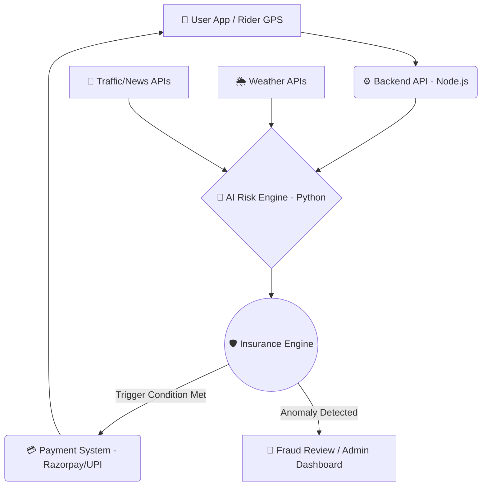

# 🛵 ShiftSafe-DT: AI-Powered Income Protection for Delivery Partners
**Phase 1: Ideation & Foundation — "Ideate & Know Your Delivery Worker"**

*An AI-enabled parametric micro-insurance platform empowering platform-based delivery partners against uncontrollable income loss.*

---

## ⚠️ Scope & Critical Constraints
- **Coverage Scope**: **Strictly LOSS OF INCOME ONLY.** The platform provides a financial safety net for lost wages due to external disruptions. It explicitly **excludes** coverage for health, life, accidents, or vehicle repairs.
- **Financial Model**: 100% **Weekly pricing basis** to perfectly match the payout cycle and cash flow of gig workers.

---

## 👥 1. Persona & Sub-Category Focus
**Sub-Category**: Food Delivery Partners (e.g., Zomato, Swiggy)

**Persona Strategy**:
Meet Ravi, a 32-year-old Food Delivery Partner in Mumbai. Ravi earns roughly ₹4,000 to ₹5,000 per week. He lives week-to-week and relies heavily on peak hours (lunch and dinner rushes). Any disruption during these hours severely impacts his weekly livelihood. When uncontrollable external disruptions occur, Ravi currently bears the full financial loss. ShiftSafe-DT is built to protect Ravi.

---

## 🌪️ 2. Core Disruptions & Parametric Triggers Defined

We define specific **External Disruptions** that act as our parametric triggers for automated payouts:

| Event | Trigger | Source API/Data |
| :--- | :--- | :--- |
| **Heavy Rain & Flooding** | Rainfall > 50mm in a 2-hour window | OpenWeatherMap API |
| **Extreme HeatWaves** | Temperature > 42°C for 3+ consecutive hours | OpenWeatherMap / IMD API |
| **Severe Pollution** | AQI > 450 (Severe+) restricting visibility | AQICN API |
| **Platform Outages** | Aggregator server down > 90 minutes | Downdetector / Direct Ping |
| **Unplanned Curfews** | Sudden zone closures/Section 144 | Government API / News Scraper |

---

## 🏗️ 3. System Architecture

ShiftSafe-DT is built on a robust, event-driven architecture designed to minimize latency and ensure zero-touch automated claims.

---

## 🔄 4. Requirement Details & Application Workflow

**Scenario: The Unforgiving Monsoon (Heavy Rain Trigger)**
*   **The Context:** An unseasonal downpour hits Ravi's operational zone in Mumbai just before the dinner rush. Delivering safely is impossible. He loses 30% of his daily earnings.
*   **The Automated Workflow:**
    1.  **Monitoring:** ShiftSafe-DT continuously monitors the Weather API for Ravi's PIN code.
    2.  **Activation:** The API registers > 50mm of rainfall. The parametric condition for "Heavy Rain" is met.
    3.  **Validation:** The system automatically validates Ravi's active weekly policy and his geolocation presence in the affected zone.
    4.  **Instant Payout:** A predefined income-replacement payout is instantly credited to Ravi's registered account (via UPI). *Zero manual claims required.*

---

## 💰 5. The Weekly Premium Model

Gig workers operate on weekly cash flows. Demanding a large upfront premium creates a massive barrier to entry. ShiftSafe-DT aligns with their financial reality through a **Weekly Micro-Premium Model**.

*   **Granular Payments:** Premiums are broken down into manageable weekly deductions (e.g., ₹15 - ₹25/week).
*   **Synchronized Deductions:** Premiums are automatically deducted on the same day aggregator platforms process their weekly payouts, ensuring the worker never feels a cash crunch.
*   **Dynamic Adjustments (AI):** The weekly premium is not static. It is dynamically adjusted based on the predictive risk for the upcoming week in the specific delivery zone.

---

## 🧠 6. AI & ML Integration Strategy

ShiftSafe-DT utilizes advanced AI to ensure platform sustainability and prevent exploitation.

*   **Dynamic Premium Pricing (Predictive Risk Modeling):**
    *   **How it works:** Machine Learning models (e.g., XGBoost, LSTMs) ingest historical weather data, traffic density, and seasonal disruption patterns to predict risk.
    *   **Implementation:** The model predicts the probability of a trigger event for the upcoming week. If Ravi operates in a zone historically safe from floods, his premium is dynamically lowered by ₹5 for that week.
*   **Intelligent Fraud Detection (Anomaly Detection):**
    *   **How it works:** Unsupervised ML algorithms (Isolation Forests) monitor user behavior to prevent "Location Spoofing" and duplicate claims.
    *   **Implementation:** The system establishes a behavioral baseline for Ravi (typical speed, login times, regular zones). If his GPS suddenly jumps 50km into a heavy rain zone exactly 5 minutes before a trigger event, the AI flags the anomaly and halts the automated payout.

---

## 💻 7. UI Prototype & Screens

*Note: As part of our Day 8-10 deliverable, we have designed the core application screens in Figma.*

**Core Flow:**
1.  **Signup/Onboarding:** Frictionless mobile number verification and ID upload.
2.  **Insurance Dashboard:** Clean view showing "Active Weekly Coverage", dynamic risk level, and total earnings protected.
3.  **Policy Purchase:** Simple one-click "Subscribe for ₹20/Week" interface.
4.  **Claim Status:** Real-time push notification indicating localized disruption detected -> processing payout -> payout successful.

---

## 🛠️ 8. Tech Stack & Development Plan

| Layer | Technology | Purpose |
| :--- | :--- | :--- |
| **Frontend Prototype** | Figma / React Native | Mobile-first application for immediate accessibility and GPS tracking. |
| **Backend API** | Node.js (Express) | High-concurrency server to handle real-time GPS pings and API requests (Planned). |
| **AI/ML Engine** | Python | Microservice for dynamic premium calculation and anomaly/fraud detection (Planned). |
| **External Integrations** | OpenWeatherMap API | Data sources for parametric triggers and mock payment execution (Planned). |

---

## 🔗 9. Phase 1 Deliverables Links

*   **GitHub Repository:** [https://github.com/anshika1179/ShiftSafe-DT](https://github.com/anshika1179/ShiftSafe-DT)
*   **Phase 1 Strategy & Prototype Video:** `[Insert Public Video Link Here]` *(Includes Problem, Solution, Architecture, and Prototype Walkthrough)*

---

  <i>Empowering India's gig economy with an automatic, AI-driven safety net.</i>

