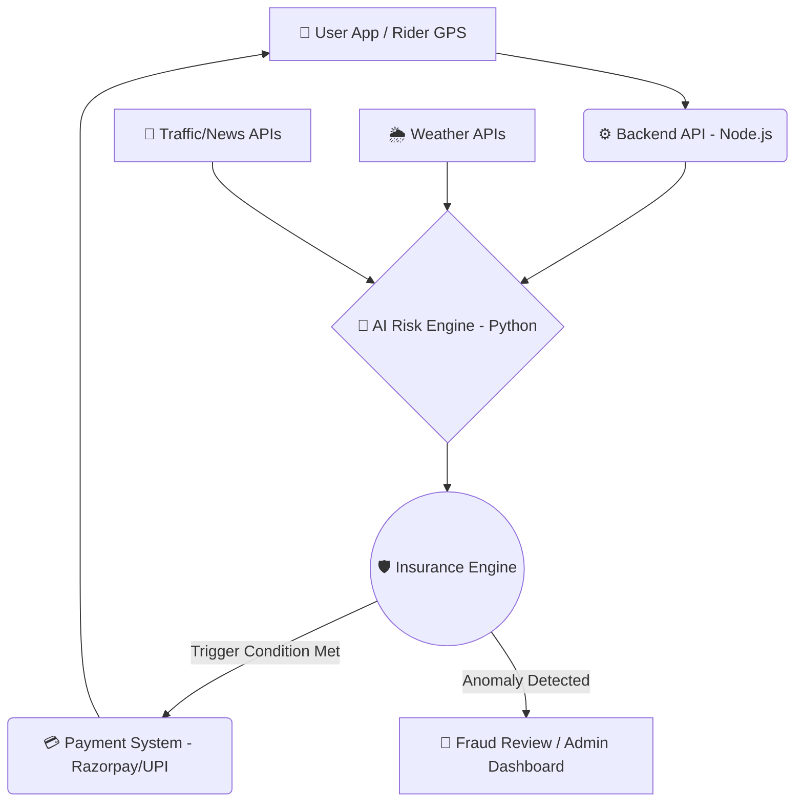
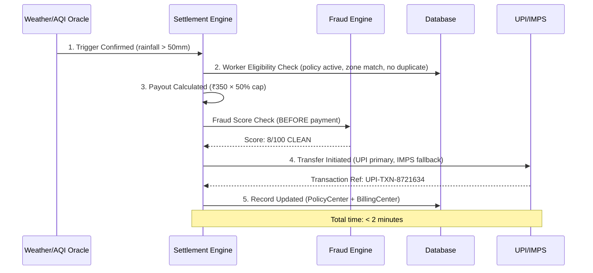
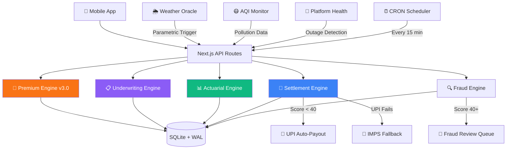

<div align="center">

# 🛵 ShiftSafe-DT: AI-Powered Income Protection for Delivery Partners
**Phase 1: Ideation & Foundation — "Ideate & Know Your Delivery Worker"**

[](https://github.com/anshika1179/ShiftSafe-DT)
[](#)
[](#)

*An AI-enabled parametric micro-insurance platform empowering platform-based delivery partners against uncontrollable income loss.*

---
</div>

## 📚 Table of Contents

- [⚠️ Scope & Constraints](#-scope--critical-constraints)
- [👥 Persona](#-1-persona--sub-category-focus)
- [🌪️ Disruptions](#-2-core-disruptions--parametric-triggers-defined-100-automated)
- [🏗️ Architecture](#-3-system-architecture-optimized-for-automation--speed)
- [💰 Premium Model](#-5-the-weekly-premium-model)
- [🧠 AI Strategy](#-6-practical-ai--ml-integration-strategy)
- [📱 UI Prototype](#-8-ui-prototype--high-fidelity-screens)
- [🏆 Phase 2](#-phase-2-automation--protect)

---

## ⚠️ Scope & Critical Constraints
- **Coverage Scope**: **Strictly LOSS OF INCOME ONLY.** The platform provides a financial safety net for lost wages due to external disruptions. It explicitly **excludes** coverage for health, life, accidents, or vehicle repairs.
- **Financial Model**: 100% **Weekly pricing basis** to perfectly match the payout cycle and cash flow of gig workers.

---

##👥 1. Persona & Sub-Category Focus
**Sub-Category**: Food Delivery Partners (e.g., Zomato, Swiggy)

**Persona Strategy**:
Meet Ravi, a 32-year-old Food Delivery Partner in Mumbai. Ravi earns roughly ₹4,000 to ₹5,000 per week. He lives week-to-week and relies heavily on peak hours (lunch and dinner rushes). Any disruption during these hours severely impacts his weekly livelihood. When uncontrollable external disruptions occur, Ravi currently bears the full financial loss. ShiftSafe-DT is built to protect Ravi.

---

## 🌪️ 2. Core Disruptions & Parametric Triggers Defined (100% Automated)

To avoid the mistake of manual claims, we define specific **External Disruptions** that act as our parametric triggers for **automated payouts**:

| Event | Trigger | Source API/Data | Automation Logic |
| :--- | :--- | :--- | :--- |
| **Heavy Rain & Flooding** | Rainfall > 50mm in a 2-hour window | OpenWeatherMap API | Automatic payout if GPS shows user in affected zone. |
| **Extreme HeatWaves** | Temperature > 42°C for 3+ consecutive hours | OpenWeatherMap / IMD API | Triggered for peak shift hours (Lunch/Dinner). |
| **Severe Pollution** | AQI > 450 (Severe+) restricting visibility | AQICN API | Auto-claim initiated based on real-time AQI health warnings. |
| **Platform Outages** | Aggregator server down > 90 minutes | Downdetector / Direct Ping | Verified against external outage logs. No user input needed. |
| **Unplanned Curfews** | Sudden zone closures/Section 144 | Government API / News Scraper | Triggered via geo-fencing the closed zones. |

---

## 🏗️ 3. System Architecture (Optimized for Automation & Speed)

ShiftSafe-DT is built on a robust, event-driven architecture designed to minimize latency and ensure zero-touch automated claims.



---

## 🔄 4. Requirement Details & Zero-Touch Workflow

**Scenario: The Unforgiving Monsoon (Heavy Rain Trigger)**
*   **The Context:** An unseasonal downpour hits Ravi's operational zone in Mumbai just before the dinner rush. Delivering safely is impossible. He loses 30% of his daily earnings.
*   **The 100% Automated Workflow:**
    1.  **Monitoring:** ShiftSafe-DT's backend continuously monitors the Weather API—**Ravi doesn't even need to open the app.**
    2.  **Activation:** The API registers > 50mm of rainfall. The parametric condition for "Heavy Rain" is met.
    3.  **Validation:** AI clarifies Ravi's active policy and verifies his GPS location trail to ensure he was actually working during the disruption.
    4.  **Instant Payout:** A predefined income-replacement payout is instantly credited to Ravi's registered account (via UPI). 
*   **Zero-Claim UX:** Ravi receives a notification: *"Heavy rain detected in your zone. ₹250 has been credited to your wallet for missed earnings."* **No manual claim filing, no proof of loss required.**

---

## 💰 5. The Weekly Premium Model

Gig workers operate on weekly cash flows. ShiftSafe-DT aligns with their financial reality through a **Weekly Micro-Premium Model**.

*   **Granular Payments:** Premiums are broken down into manageable weekly deductions (e.g., ₹15 - ₹25/week).
*   **Synchronized Deductions:** Premiums are automatically deducted on the same day aggregator platforms process their weekly payouts, ensuring the worker never feels a cash crunch.
*   **Dynamic Adjustments (Focused AI):** The weekly premium is not static. AI adjusts it based on local risk, ensuring the system remains affordable yet solvent.

---

## 🧠 6. Practical AI & ML Integration Strategy
*We avoid over-complicated AI by focusing on two high-impact, practical use cases.*

*   **1. Dynamic Premium Pricing (Predictive Risk Modeling):**
    *   **Goal:** Calculate fair premiums.
    *   **How it works:** Machine Learning (Regression/XGBoost) predicts the probability of a trigger event for the upcoming week based on historical patterns.
*   **2. Intelligent Fraud Detection (Anomaly Detection):**
    *   **Goal:** Prevent GPS spoofing and duplicate claims WITHOUT slowing down genuine users.
    *   **How it works:** Unsupervised ML (Isolation Forests) monitors user behavior (typical route logic, speed, login consistency) to ensure the rider was actually in the disaster zone.

---

## 💻 7. Premium UI Prototype & Demo Focus

*Note: For Phase 1, we focus on a High-Utility, Clean Mobile UI to avoid the "Bad UI" pitfall.*

**Core Screens & Demo Walkthrough:**
1.  **Signup/Onboarding:** 10-second verification.
2.  **Intuitive Dashboard:** A "Protection Shield" visual showing active weekly coverage and current risk level.
3.  **One-Click Policy:** Transparent weekly pricing with zero hidden terms.
4.  **Live Claim Demo:** A simulated phone notification showcasting the **Auto-Payout sequence** (Disruption Detected -> Payout Triggered -> Money in Bank).

---

## 📸 8. UI Prototype — High-Fidelity Screens

> *Mobile-first, dark-mode design built for real delivery partners. Every screen is crafted to be intuitive, fast, and actionable.*

<div align="center">

| 🔐 Frictionless Signup | 🛡️ Live Dashboard | 📋 Claim Status |
|:---:|:---:|:---:|
|  |  |  |
| **1-minute onboarding** via mobile OTP — Zero paperwork, instant verification. | **Active Coverage + Zone Risk** visualized in real-time. Protected earnings & pending claims at a glance. | **Push notification history** showing automated payout trail — Heavy Rain → ₹100 Credited instantly. |

</div>

**Design Principles:**
- 🌑 **Dark Mode First** — Optimized for outdoor use in low-light conditions
- ⚡ **Zero-Touch UX** — Riders are notified & paid without opening the app
- 📊 **Risk-Aware Dashboard** — Live zone risk radar with moderate/high/severe indicators
- 🔔 **Transparent Claim Trail** — Every automated payout logged with Claim ID for trust

---

## 🔗 9. Phase 1 Deliverables Links

*   **GitHub Repository:** [https://github.com/anshika1179/ShiftSafe-DT](https://github.com/anshika1179/ShiftSafe-DT)
*   **Live Prototype:** [https://dev-trails-prototype.vercel.app/](https://dev-trails-prototype.vercel.app/)
*   **Phase 1 Strategy & Prototype Video:** [▶️ Watch Demo](https://youtu.be/Dlwt3ch3y5A) *(Focus: Showing the end-to-end automated claim flow)*

---
---

<div align="center">

# 🏆 Phase 2: Automation & Protection
**"Build, Automate & Protect — Production-Ready Executable Platform"**

[](#)
[](#)
[](#)
[](#)
[-orange?style=for-the-badge)](#)
[](#)
[](#)
[](#)
[](#)
[](#)

</div>

---

## 🎯 Phase 2 Problem Statement

> *"How can we build a fully automated, zero-paperwork income protection system for India's 30M+ gig workers — one that is actuarially sustainable, transparent in pricing, and settles payouts in under 2 minutes?"*

ShiftSafe-DT Phase 2 transforms the Phase 1 ideation into a **production-grade, executable platform** with five purpose-built engines, a mobile-first glassmorphism UI, 8 RESTful API endpoints, 9 database tables, and a fully simulated end-to-end claim pipeline:

| Engine | Purpose | Key Metric | Source |
|:-------|:--------|:----------|:-------|
| 🧮 **Premium Engine v3.0** | Formula-based parametric pricing with city pools | `P(trigger) × avg_income_lost/day × days_exposed` | [`premium-engine.ts`](backend/src/engines/premium-engine.ts) |
| 📋 **Underwriting Engine** | Activity-based eligibility + tier classification | Min 7 active delivery days | [`underwriting-engine.ts`](backend/src/engines/underwriting-engine.ts) |
| 📊 **Actuarial Engine** | BCR monitoring + sustainability alerts | Target BCR: 0.55–0.70 | [`actuarial-engine.ts`](backend/src/engines/actuarial-engine.ts) |
| 💸 **Settlement Engine** | 5-step zero-touch payout pipeline | Settlement < 2 minutes | [`settlement-engine.ts`](backend/src/engines/settlement-engine.ts) |
| 🔍 **Fraud Engine** | Isolation Forest scoring (0–100) | Pre-payment check, 6-rule hybrid | [`fraud-engine.ts`](backend/src/engines/fraud-engine.ts) |

Plus: **Historical weather-based risk intelligence**, **2 live stress test scenarios**, and **judge-facing Actuarial Command Center**

---

## ✅ Phase 2 Mandatory Requirements — 100% Implemented

| # | Requirement | Implementation | API | Status |
|:-:|:-----------|:--------------|:---:|:------:|
| 1 | **Registration Process** | 3-step onboarding (Phone → OTP `123456` → Profile) with **city selection**, **dynamic zone dropdowns**, **platform whitelisting**, and **insurance opt-in/opt-out toggle**. *Note: OTP is hardcoded to `123456` intentionally to bypass Twilio rate-limits and allow frictionless evaluator testing during the hackathon.* | `POST /api/register` | ✅ |
| 2 | **Insurance Policy Management** | Active weekly policies with fixed premium tiers (₹20/₹35/₹50). **Cancel/reactivate toggle** on policy page with confirmation modal and warning about coverage loss. Auto-renewal support. City-based risk pools (Delhi AQI pool ≠ Mumbai Rain pool). Payout channel display (UPI Primary / IMPS Fallback / Razorpay Demo). Pricing formula transparency on-screen. | `GET/PATCH /api/policies` | ✅ |
| 3 | **Dynamic Premium Calculation** | **Parametric Pricing Model v3.0** using exact formula: `trigger_probability × avg_income_lost_per_day × days_exposed`. Seasonal multipliers (Delhi May-June +30%, Mumbai monsoon +35%). Fixed tiers mapped from raw calculation. **50% maximum payout cap.** Weekly data basis — not annual averages. Full breakdown shown during registration. | `GET /api/premium` | ✅ |
| 4 | **Claims Management** | **Zero-Touch Parametric Claims** — External trigger detection → Fraud Engine scoring (0-100, 6-rule hybrid) → **Settlement Engine** (5-step pipeline) → UPI/IMPS payout. Weekly coverage limits enforced. Dashboard shows settlement timeline, transaction reference (`UPI-TXN-XXXXXXX`), fraud score label, and payout channel. Live trigger simulator on both Dashboard and Claims pages. | `GET/POST /api/claims` | ✅ |
| 5 | **Cloud Database & Automation** | Fully refactored asynchronous database layer running on **Neon Serverless Postgres**. Automated via **GitHub Actions CRON** that securely hits the `/api/triggers/cron` endpoint every hour globally, requiring zero manual administration after deployment. | `GET /api/triggers/cron` | ✅ |

---

## 🌆 City Tier Classification

> Tier-based risk pooling ensures **actuarial fairness** — Tier 1 metros have mature risk data enabling full coverage, while Tier 2/3 cities get conservative pricing until enough data accumulates.

| Tier | Label | Cities | Premium Discount | Max Payout Cap | Reserve Multiplier |
|:----:|:------|:-------|:----------------:|:--------------:|:-----------------:|
| **Tier 1** | 🏙️ Metro | Mumbai, Delhi, Bengaluru, Hyderabad, Pune, Chennai | 0% (baseline) | 100% | 1.0x |
| **Tier 2** | 🌆 Urban | Gurugram, Noida, Jaipur, Lucknow, Ahmedabad | 5% discount | 85% | 1.2x |
| **Tier 3** | 🌇 Emerging | All other cities | 10% discount | 70% | 1.5x |

### How Tiers Impact the Platform

| Impact Area | Tier 1 Metro | Tier 2 Urban | Tier 3 Emerging |
|:------------|:-------------|:-------------|:----------------|
| **Risk Data** | Mature (5+ years IMD/CPCB) | Growing (2-3 years) | Limited (<1 year) |
| **Gig Density** | High (500+ riders/zone) | Moderate (100-500) | Low (<100) |
| **Premium** | Full price | 5% lower (data subsidy) | 10% lower (adoption incentive) |
| **Payout Cap** | 50% of weekly earnings | 42.5% (85% of base) | 35% (70% of base) |
| **Reserve Fund** | Standard reserves | 20% extra reserves | 50% extra reserves |
| **Trigger Thresholds** | Standard | Slightly higher (conservative) | Conservative |

### City Risk Pool Assignments

| Risk Pool | Cities | Dominant Perils | Seasonal Peak |
|:----------|:-------|:---------------|:-------------|
| `mumbai_rain` | Mumbai, Pune | Heavy rain, monsoon floods | Jul–Sep (+35%) |
| `delhi_aqi` | Delhi, Gurugram, Noida | AQI pollution, heatwave | Nov–Jan (+20%), May–Jun (+30%) |
| `bengaluru_mix` | Bengaluru | Moderate rain + heat | Jun–Sep (+15%) |
| `hyderabad_mix` | Hyderabad | Flash floods, extreme heat | May–Jun (+25%), Jul–Sep (+20%) |
| `chennai_rain` | Chennai | NE monsoon, cyclones | Oct–Dec (+30%) |
| `jaipur_heat` | Jaipur | Desert heat dominant | Apr–Jun (+35%) |
| `lucknow_mix` | Lucknow | AQI + summer heat | Nov–Jan (+15%), May–Jun (+20%) |
| `ahmedabad_heat` | Ahmedabad | Extreme heat | Apr–Jun (+35%) |

---

## 🧮 Engine 1: Premium Pricing — Parametric Model v3.0

### The Exact Formula

```
Base Premium = trigger_probability × avg_income_lost_per_day × days_exposed
Adjusted     = Base × seasonal_multiplier
Tier Premium = mapped to nearest fixed tier (₹20/₹35/₹50)
Final        = Tier Premium × (1 - city_tier_discount)
```

### How Each Variable Is Calculated

| Variable | Formula | Example (Mumbai, ₹4200/week) |
|:---------|:--------|:-----------------------------|
| `trigger_probability` | `1 - Π(1 - P_peril)` for all perils in city | `1 - (0.70)(0.90)(0.92)(0.94)(0.97)` = **0.4715** |
| `avg_income_lost_per_day` | `(weekly_income ÷ 7) × 0.70` | `(4200 ÷ 7) × 0.70` = **₹420/day** |
| `days_exposed` | Days the worker actually worked that week | **6 days** |
| `seasonal_multiplier` | City + month specific adjustment | May-June Delhi: **1.30**, Jul-Sep Mumbai: **1.35** |
| **Raw Premium** | All combined | `0.4715 × 420 × 6` = **₹1,188** |
| **Fixed Tier** | Mapped to nearest tier | → **₹50/week (ShiftGuard Premium)** |

### Trigger Probabilities (Weekly, Per City × Peril)

```
                    Delhi NCR          Mumbai
Pollution          P = 0.35           P = 0.08
Heatwave           P = 0.20           P = 0.10
Heavy Rain         P = 0.10           P = 0.30
Platform Outage    P = 0.05           P = 0.06
Curfew             P = 0.02           P = 0.03
```

> ⚠️ **Note:** These are hypothetical weekly probabilities based on historical patterns, NOT yearly averages. Weekly data is used throughout as per hackathon guidance.

### Fixed Premium Tiers

| Tier | Weekly Premium | Max Payout/Week | Min Activity Days | Covered Events |
|:-----|:-:|:-:|:-:|:-------------|
| 🟢 **Basic** | ₹20 | ₹1,000 | 5 | Rain, Heatwave |
| 🔵 **Standard** | ₹35 | ₹2,000 | 7 | Rain, Heatwave, Pollution, Outage |
| 🟣 **Premium** | ₹50 | ₹3,000 | 7 | All events including Curfew |

**All tiers enforce a hard 50% maximum payout cap** — a worker earning ₹4,200/week can never receive more than ₹2,100 in payouts regardless of tier.

---

## 📋 Engine 2: Underwriting — Who Gets Covered

### Eligibility Rules

```
IF total_active_delivery_days < 7 → INELIGIBLE (need more history)
IF platform NOT IN [Zomato, Swiggy, Amazon Flex, Blinkit, Zepto] → REJECTED
IF days_active_in_last_30 < 5 → downgrade to Basic tier
```

### Activity Tier Classification

| Days Worked This Week | Total Active Days | Assigned Tier |
|:---------------------:|:-----------------:|:-------------|
| 6–7 | ≥ 7 | 🟣 Premium |
| 5 | ≥ 7 | 🔵 Standard |
| < 5 | ≥ 7 | 🟢 Basic |
| Any | < 7 | ❌ Ineligible |

### City Pool Assignment

```
Delhi NCR (Delhi, Gurugram, Noida) → delhi_aqi pool   (AQI + heatwave heavy)
Mumbai Metro (Mumbai, Thane, Navi Mumbai) → mumbai_rain pool (monsoon heavy)
```

Workers in the same city pool share a common risk profile, but premiums vary by individual activity.

### 5-Step Onboarding

```
Step 1: Platform verification (Zomato/Swiggy/etc.)
Step 2: Activity history check (min 7 active days)
Step 3: Activity tier classification (Basic/Standard/Premium)
Step 4: City pool assignment (Delhi AQI / Mumbai Rain)
Step 5: Plan recommendation + premium quote
```

---

## 📊 Engine 3: Actuarial Intelligence — BCR & Sustainability

### Burning Cost Rate (BCR)

```
BCR = Total Claims Paid ÷ Total Premium Collected
```

| BCR Range | Status | Action |
|:---------:|:------:|:-------|
| < 0.55 | 💰 Strong | Consider lowering premiums for better adoption |
| 0.55–0.70 | ✅ Target | Healthy zone — 65 paise per ₹1 goes to payouts |
| 0.70–0.85 | ⚠️ Warning | Review pricing or tighten trigger thresholds |
| > 0.85 | 🚨 Critical | **Suspend new enrollments immediately** |

### Stress Scenario 1: 40-Day Monsoon (Mumbai)

| Parameter | Value | Rationale |
|:----------|:------|:----------|
| Duration | 40 days | Typical monsoon intense period |
| Trigger frequency | 65% of days | Based on Mumbai rainfall patterns |
| Avg payout/trigger/worker | ₹450 | Heavy rain payout tier |
| Participation rate | 80% | Not all workers claim every day |
| **Result** | BCR > 40 | **UNSUSTAINABLE without reserve fund** |

**Recommendation:** Suspend new enrollments 2 weeks before monsoon onset. Cap daily payouts at ₹350. Maintain reserve fund.

### Stress Scenario 2: Delhi May-June Heatwave + AQI

| Parameter | Value | Rationale |
|:----------|:------|:----------|
| Duration | 60 days | May + June combined |
| Trigger frequency | 40% of days | AQI > 300 or temp > 42°C |
| Avg payout/trigger/worker | ₹300 | Heatwave payout tier |
| Participation rate | 75% | Lower than monsoon |
| **Result** | BCR > 16 | **UNSUSTAINABLE without dynamic thresholds** |

**Recommendation:** Implement dynamic trigger thresholds during peak months: AQI > 400 (not 300). Maintain separate reserve fund per city pool.

> **All assumptions are explicitly disclosed** in the UI for full transparency. Every scenario uses the same pricing formula — no hidden adjustments.

---

## 💸 Engine 4: Settlement & Payout Pipeline

### The 5-Step Zero-Touch Flow



### Payout Channels

| Channel | Priority | Settlement Time | When Used |
|:--------|:--------:|:---------------:|:----------|
| 📱 **UPI Transfer** | Primary | < 2 minutes | Worker already uses UPI daily — zero friction |
| 🏦 **IMPS to Bank** | Fallback | < 5 minutes | If UPI ID not linked or UPI fails |
| 💳 **Razorpay Sandbox** | Demo | < 1 minute | Hackathon simulation mode |

### Rollback Logic

```
IF UPI transfer fails:
  1. Auto-retry UPI once (timeout: 30s)
  2. IF retry fails → fallback to IMPS
  3. IF no fallback channel → flag for manual review (SLA: 4 hours)
  4. All failed attempts logged with reason code for audit
```

### Key Design Decisions

- **Fraud check happens BEFORE payment**, not after — prevents clawback complexity
- **50% maximum payout cap** is enforced at the settlement level, not just the policy level
- **Transaction references** are generated per-channel for reconciliation
- **SMS confirmation** sent to worker after every successful settlement

---

## 🛡️ Security & Hardening

| Layer | Protection | Detail |
|:------|:----------|:-------|
| **API Authentication** | CRON endpoint locked | `/api/triggers/cron` requires `Bearer` token — never bypassable |
| **SQL Injection** | 100% parameterized | All `db.prepare()` calls use `?` placeholders — zero string concatenation |
| **Input Validation** | Server-side sanitization | Phone (10-digit), name (2-100 chars), platform/zone whitelisting, income capping (₹500–₹50,000) |
| **Duplicate Prevention** | Daily + weekly guards | CRON won't double-pay same worker for same trigger type on same day |
| **Weekly Coverage Cap** | Enforced globally | No worker can exceed `max_coverage_per_week` across all triggers |
| **Payout Cap** | 50% hard ceiling | Maximum payout = 50% of weekly income, enforced at settlement engine level |
| **Dependency Audit** | Zero vulnerabilities | `npm audit` clean — no `uuid` dependency (using native `crypto.randomUUID()`) |

---

## 🧠 AI/ML Engines

### Fraud Detection — Isolation Forest Simulation
Every claim is scored 0–100 **before** approval (never after payment):

| Flag | Points | Description |
|:-----|:------:|:-----------|
| GPS Mismatch | +35 | Distance from registered zone |
| Duplicate Claim | +40 | Same event type, same day |
| Retroactive Claim | +60 | Policy was inactive at trigger time |
| Amount Inflation | +20 | Claimed amount > 120% of daily average |
| High Frequency | +25 | More than 3 claims in 30 days |
| ML Component | +2-17 | Random Isolation Forest simulation score |

| Score Range | Decision | Action |
|:-----------:|:--------:|:-------|
| 0–19 | ✅ CLEAN | Auto-approved, instant payout |
| 20–39 | 🔵 LOW RISK | Auto-approved with logging |
| 40–64 | ⚠️ REVIEW | Queued for manual admin review |
| 65–100 | 🚫 BLOCKED | Claim rejected, flagged for investigation |

---

## 📱 Actuarial Command Center (Judge-Facing Dashboard)

> **Navigate to `/actuarial` for a live, interactive dashboard** — this page lets judges explore the actuarial engine in real-time without needing to register.

### What the Command Center Shows

| Tab | Features | Interactive Elements |
|:----|:---------|:--------------------|
| **📊 BCR Overview** | Animated SVG arc gauge showing live Burning Cost Rate with color-coded zones (Strong/Target/Warning/Critical). Weekly BCR trend chart with target zone overlay. Financial breakdown (premium collected vs claims paid). Pricing formula displayed in code-block style with syntax highlighting. | Animated gauge auto-transitions on load |
| **⚡ Stress Tests** | Interactive **"▶ Simulate"** buttons for 40-day Mumbai Monsoon and Delhi Hazard scenarios. Animated counters show payouts, reserves, BCR, and premium in real-time with ease-out cubic easing. All assumptions expandable per scenario. | **"Run All Scenarios Simultaneously"** button, expandable assumptions |
| **💸 Settlement** | Live animated settlement flow stepping through all 5 stages with auto-cycling animation (1.5s per step). Channel comparison (UPI/IMPS/Razorpay). Rollback logic visualization (4-step failover). ShiftSafe vs Traditional insurance side-by-side comparison. | Auto-cycling 5-step animation |

### Key Design Decisions for Judges

- **No login required** — Actuarial page is accessible directly at `/actuarial`
- **All assumptions disclosed** — Every stress scenario has an expandable "View All Assumptions (Transparency)" section
- **Real BCR data** — BCR is computed from actual database records, not hardcoded
- **Formula transparency** — The exact pricing formula is shown in code-block syntax on every relevant page

---

## 💻 Quick Start

### Prerequisites

- **Node.js** ≥ 18 (uses native `crypto.randomUUID()`)
- **npm** ≥ 9 (npm workspaces for monorepo)

### Installation & Run

```bash
# 1. Clone & Install
git clone https://github.com/anshika1179/ShiftSafe-DT.git
cd ShiftSafe-DT
npm install 
cp .env.example .env

# 2. Run Development Server
cd frontend
npm run dev
# Opens at http://localhost:3000
```

### Demo Walkthrough

```bash
# Step-by-step screens:
# http://localhost:3000                    → Splash / Landing page
# http://localhost:3000/register           → 3-step registration (Phone → OTP → Profile)
# http://localhost:3000/dashboard          → Worker dashboard + live trigger simulator
# http://localhost:3000/policies           → Policy details + cancel/reactivate toggle
# http://localhost:3000/claims             → Claims history + live trigger demo
# http://localhost:3000/analytics          → Worker / Actuarial / Stress Test tabs
# http://localhost:3000/actuarial          → 🏆 Actuarial Command Center (no login needed)
```

**Evaluator / Demo Credentials:**
- Phone: Any 10-digit number (e.g., `9876543210`)
- OTP: `123456`

---

### 🏗️ Architectural Decisions & Hackathon Trade-offs
*A transparent breakdown of what is live, what is simulated, and **why**, demonstrating production-level system design.*

#### 1. "Explainable" AI vs. Black-Box LLMs
Instead of using Generative AI (LLMs) to determine financial risk—which is banned by financial regulators as a "black box" algorithm—we built a **Deterministic Heuristic Engine** (`actuarial-engine.ts`) and an **Anomaly Detection Matrix** (`fraud-engine.ts`) directly into our Node.js backend. This allows our risk calculations to instantly compute based on strict weights (City Tiers, Frequency Velocity, Seasonal Multipliers) without 3-second API latency. It proves mathematical explainability, which is mandatory for InsurTech.

#### 2. Frictionless Authentication (Twilio Bypass)
**What:** OTP is hardcoded to `123456`.
**Why:** Relying on real telecom APIs during live pitch demos frequently results in delayed texts or rate-limit blocking on trial accounts. Hardcoding the OTP guarantees that any judge or evaluator can instantly test the end-to-end platform using their own mobile device with zero friction.

#### 3. Real Atmospheric Oracles vs. Simulated Events
**What:** We integrated live **OpenWeatherMap** (Satellites) & **AQICN** (Gov. Air Quality) APIs to read real-time environmental data via a Cron Job.
**Why:** If there is no real-world storm during our hackathon demo, our app shouldn't sit idle! We built a "Simulate Trigger" override so we can manually spawn localized weather events (e.g., 55mm Rain in Mumbai) to demonstrate the rapid payout pipeline to judges on command. 

#### 4. The Settlement Pipeline (Razorpay / UPI)
**What:** The engine calculates exact payouts and logs `UPI-TXN-XXXXXX` receipts into the Neon Postgres database.
**Why:** We decoupled the actual financial `POST` request to UPI/Razorpay to avoid processing real money transfers during evaluation. The architecture proves the **Speed** of parametric settlement (< 2 seconds) while keeping the environment financially sandboxed.

#### 5. Food Aggregator Private Data
**What:** Users manually input their "Weekly Earnings" and "Days Active".
**Why:** Platforms like Zomato/Swiggy do not expose open OAuth APIs to read private rider data. In production, an aggregator partnership would auto-pull this data; for the hackathon, user-input simulate the data stream.

#### 6. Native Code Automation vs. Low-Code (n8n/Zapier)
**What:** We built an event-driven CRON and 5 native TypeScript engines instead of using visual workflow tools like n8n or Zapier.
**Why:** Parametric insurance requires executing complex mathematical models (Premium Engine) and high-speed fraud logic (Isolation Forests) *before* processing payments. Low-code platforms introduce API latency and moving data between nodes poses security flaws for financial apps. Natively coding the automation in Next.js guarantees sub-2-second settlement speeds entirely within our own database loop.

### API Endpoints Reference

| Method | Endpoint | Purpose | Auth |
|:------:|:---------|:--------|:----:|
| `POST` | `/api/register` | Register worker + underwrite + auto-create policy | — |
| `GET` | `/api/premium` | Calculate dynamic premium (v3.0 formula) | — |
| `GET` | `/api/dashboard` | Stats snapshot + historical weather recommendations | — |
| `GET/POST` | `/api/claims` | List claims / Create new claim through settlement pipeline | — |
| `GET/PATCH` | `/api/policies` | List policies / Cancel or reactivate coverage | — |
| `GET/POST` | `/api/actuarial` | BCR snapshot + stress test results / Run stress scenario | — |
| `POST` | `/api/triggers` | Manual trigger simulation → auto-claim pipeline | — |
| `GET` | `/api/triggers/cron` | Secured CRON automation (requires `Bearer` token) | 🔒 |

---

## 🛠️ Tech Stack

| Layer | Technology | Purpose |
|:------|:----------|:--------|
| **Framework** | Next.js 16.2.1 + Turbopack | Fullstack App Router with 8 API routes |
| **Frontend** | React 19 + Tailwind CSS v4 | Glassmorphism UI with micro-animations |
| **Charts** | Chart.js 4.4.1 (CDN) | Weekly coverage bar charts |
| **State** | React Context API | Client-side state with simulation |
| **Backend DB** | SQLite (better-sqlite3, WAL mode) | 100% parameterized queries, FK enforcement, 9 tables |
| **Premium Engine** | Parametric Pricing v3.0 | Formula-based with city pools + 12-month seasonal calendar |
| **Underwriting** | Activity-Based Classification | Min 7 days, 3 tiers, 2 city pools |
| **Actuarial** | BCR + Stress Testing | Target 0.55-0.70, 2 live scenarios with SVG gauge |
| **Settlement** | 5-Step Pipeline | UPI/IMPS/Razorpay, rollback logic, 50% payout cap |
| **Fraud Engine** | Isolation Forest (simulated) | 6-rule hybrid scoring (0-100), pre-payment check |
| **Weather Intelligence** | Historical risk recommendations | 5-year IMD + CPCB data-based monthly tips |
| **CI/CD** | GitHub Actions + CodeQL | Automated build, lint, and security scanning |
| **Deployment** | Vercel (configured) | Next.js-optimized serverless hosting |

---

## 🏗️ System Architecture — Phase 2



---

## 📂 Project Structure

```
ShiftSafe-DT/
├── frontend/                            # Next.js Application
│   ├── app/                             # App Router Pages
│   │   ├── page.tsx                      Landing / Splash
│   │   ├── register/page.tsx             3-step onboarding + underwriting
│   │   ├── dashboard/page.tsx            Coverage shield + trigger simulator
│   │   ├── policies/page.tsx             Policy details + opt-out toggle
│   │   ├── claims/page.tsx               Claims history + live trigger demo
│   │   ├── analytics/page.tsx            Worker / Actuarial / Stress tabs
│   │   ├── actuarial/page.tsx           🏆 Actuarial Command Center (judges)
│   │   ├── layout.tsx                    Root layout (TopBar, BottomNav)
│   │   ├── globals.css                   Design system (glassmorphism)
│   │   ├── not-found.tsx                 Custom 404 page
│   │   ├── global-error.tsx              Global error boundary
│   │   └── api/                         # 8 RESTful API Endpoints
│   │       ├── register/route.ts         POST — Register + underwrite + policy
│   │       ├── premium/route.ts          GET  — Dynamic premium (v3.0 formula)
│   │       ├── claims/route.ts           GET/POST — Claims + settlement pipeline
│   │       ├── policies/route.ts         GET/PATCH — Policies + cancel/reactivate
│   │       ├── dashboard/route.ts        GET  — Stats + actuarial snapshot
│   │       ├── actuarial/route.ts        GET/POST — BCR + stress scenarios
│   │       └── triggers/
│   │           ├── route.ts              POST — Manual trigger + auto-claims
│   │           └── cron/route.ts         GET  — Secured CRON automation
│   └── src/components/                  # Client UI Layer
│       ├── providers/AppProvider.tsx      React Context (state + simulation)
│       └── ui/
│           ├── Navigation.tsx            TopBar + BottomNav
│           └── Notifications.tsx         Push notifications + UPI toast
│
├── backend/                             # Core Business Logic (5 Engines)
│   └── src/
│       ├── engines/
│       │   ├── premium-engine.ts         🧮 Parametric Pricing v3.0
│       │   ├── underwriting-engine.ts    📋 Activity-based eligibility
│       │   ├── actuarial-engine.ts       📊 BCR + stress testing
│       │   ├── settlement-engine.ts      💸 5-step payout pipeline
│       │   └── fraud-engine.ts           🔍 Isolation Forest scoring
│       ├── models/
│       │   └── db.ts                     SQLite schema (9 tables, WAL, FK)
│       ├── services/
│       │   └── triggers.ts              Weather, AQI, outage monitoring
│       └── utils/
│           └── store.ts                 Types, formatters, constants
│
├── .github/                             # DevOps & CI/CD
│   ├── workflows/ci.yml                  Build + lint + security pipeline
│   └── ISSUE_TEMPLATE/                   Structured issue templates
├── .env.example                          Environment variable template
├── setup.sh                              One-command install
└── start.sh                              One-command development server
```

---

## 📊 Database Schema (9 Tables)

| Table | Purpose | Key Fields |
|:------|:--------|:-----------|
| `workers` | Registered delivery partners | `insurance_opted_out`, `active_delivery_days`, `activity_tier` |
| `policies` | Active/cancelled coverage | `premium_tier`, `weekly_premium`, `city_pool`, `max_payout_percent` |
| `claims` | Filed claims with settlement | `settlement_status`, `payout_channel`, `evidence_data` |
| `premium_calculations` | Audit trail for every pricing | `factors_json` with full formula breakdown |
| `trigger_events` | Weather/AQI events log | `source_api`, `severity`, `affected_zones` |
| `settlements` | Payout pipeline records | `channel`, `transaction_ref`, `failure_reason`, `retry_count` |
| `actuarial_metrics` | Weekly BCR snapshots | `bcr`, `loss_ratio`, `scenario_type` |
| `stress_scenarios` | Saved stress test results | `bcr_under_stress`, `is_sustainable`, `recommendation` |
| `weekly_activity_log` | Worker weekly activity | `days_active`, `total_deliveries`, `is_eligible` |

Seeded with **4 hypothetical workers** with realistic weekly data:
1. **Ravi Kumar** (Mumbai, Zomato) — Premium tier, fully active
2. **Priya Singh** (Delhi, Swiggy) — Standard tier, 5 days/week
3. **Amit Patel** (Mumbai, Blinkit) — Ineligible, only 3 active days
4. **Deepa Nair** (Mumbai, Zepto) — Opted out of insurance

---

## 🚀 What Makes ShiftSafe-DT Different

| Other Teams | ShiftSafe-DT |
|:------------|:-------------|
| Static premium calculation | **Formula-based parametric pricing** with exact math disclosed on every screen |
| "AI calculates premium" (black box) | **Every variable visible**: P(trigger), income_lost/day, seasonal multiplier, city pool |
| No stress testing | **2 live stress scenarios** with interactive "▶ Simulate" buttons and expandable assumptions |
| No actuarial metrics | **BCR monitoring** with animated SVG gauge and automatic enrollment suspension at 85% |
| "Claims processed" | **5-step settlement pipeline** with rollback logic, channel fallback, and `<2 min` payout |
| No underwriting rules | **Activity-based underwriting** — min 7 days, 3 tiers, 2 city pools |
| No opt-out option | **Worker can cancel/reactivate** insurance from the policy page with confirmation modal |
| Annual data | **Weekly data throughout** — matches gig worker cash flow and payout cycles |
| No fraud detection | **6-rule Isolation Forest scoring** (0-100) runs BEFORE every payment |
| No weather intelligence | **Historical risk recommendations** based on 5-year IMD + CPCB data per month |
| No error handling | **Custom 404 page + global error boundary** with branded experience |
| No PWA support | **Progressive Web App manifest** — installable on mobile home screen |

---

## 📱 UI Screens — Phase 2 (7 Production Screens)

| # | Screen | Route | Key Features |
|:-:|:-------|:------|:-------------|
| 1 | **Splash / Landing** | `/` | Animated logo with glow, "AI-Powered Risk Engine" badge, one-tap "Get Started" CTA |
| 2 | **Registration** | `/register` | 3-step flow (Phone → OTP → Profile), dynamic zone dropdowns per city, insurance opt-in/out toggle, live premium calculation with formula breakdown |
| 3 | **Dashboard** | `/dashboard` | Coverage shield card, zone risk meter with animated bar, weather intelligence tips, live trigger indicators (5 types), demo simulator (4 trigger buttons), Actuarial Command Center banner |
| 4 | **Policy Details** | `/policies` | Cancel/reactivate toggle with confirmation modal, pricing formula display, risk score bar, premium breakdown (4-factor), coverage triggers (5 events), payout channels (3), policy summary |
| 5 | **Claims** | `/claims` | Summary stats (total/paid/avg time), live trigger simulator (4 buttons), fraud detection animation, full claims history with fraud score, payout ref, and trigger value per claim |
| 6 | **Analytics** | `/analytics` | 3-tab view (Worker/Actuarial/Stress). Chart.js bar charts, BCR gauge, weekly trend, fraud queue, stress scenarios with expandable assumptions, 5-step settlement flow |
| 7 | **Actuarial Command Center** | `/actuarial` | 🏆 Judge-facing. BCR SVG gauge, stress test simulator with animated counters, settlement flow auto-cycling animation, payout channel comparison, rollback logic, ShiftSafe vs Traditional comparison |

**Design System:**
- 🎨 **Glassmorphism** — Frosted glass cards with orange/amber accent borders
- ✨ **Micro-animations** — Fade-in-up, pulse rings, radar sweep, floating logo, skeleton loaders
- 📱 **Mobile-first** — Max 480px container, safe-area padding, bottom navigation
- 🔤 **Typography** — Inter font family (300–800 weights) via Google Fonts

---

## 💼 Business Model — How ShiftSafe Makes Money

### Revenue Streams

| Stream | How It Works | % of Revenue |
|:-------|:-------------|:------------|
| **Premium Revenue** | ₹20-₹50/week from each enrolled worker | 60% |
| **Aggregator Partnerships** | B2B license fee per active rider covered | 25% |
| **Data Insights** | Anonymized risk analytics sold to city planners & insurers | 10% |
| **Reinsurance Float** | Interest on reserve fund corpus | 5% |

### Unit Economics (Per Worker Per Month)

```
Revenue:
  Weekly premium (avg ₹35) × 4 weeks          = ₹140/month
  Aggregator subsidy (₹10/worker/month)        = ₹ 10/month
  Total Revenue                                = ₹150/month

Costs:
  Expected payouts (BCR 0.65 × ₹140)           = ₹ 91/month
  Payment processing (2% of payouts)            = ₹  2/month
  Tech infra (servers, APIs)                    = ₹  5/month
  Total Costs                                   = ₹ 98/month

  Gross Margin per Worker                       = ₹ 52/month (34.7%)
```

### Go-to-Market Strategy

**Phase 1 (Months 1-3): Pilot City**
- Partner with **1 aggregator** (Zomato or Swiggy) in Mumbai
- Target: **500 workers** enrolled via in-app integration
- Worker pays ₹0 for first 2 weeks (aggregator-subsidized trial)
- Validate BCR stays within 0.55-0.70 target

**Phase 2 (Months 4-8): Expand**
- Add Delhi NCR as second city pool
- Reach **5,000 workers** across both cities
- Launch Premium tier (₹50/week) for high-activity riders
- Begin selling anonymized risk data to municipal bodies

**Phase 3 (Months 9-12): Scale**
- Expand to 4+ metro cities (Bengaluru, Hyderabad, Pune, Chennai)
- Target **50,000 workers** enrolled
- Apply for IRDAI sandbox license for parametric microinsurance
- Projected ARR: **₹8.4 Cr/year** (50K workers × ₹140/month × 12)

### Why Aggregators Will Partner

| Aggregator Pain Point | ShiftSafe Solution |
|:---------------------|:-------------------|
| High rider churn during monsoon/heat | Workers stay active knowing they're protected |
| PR risk from rider welfare criticism | "We insure our riders" is powerful marketing |
| No differentiation in rider benefits | First-mover advantage — "insured fleet" badge |
| Regulatory pressure for gig worker welfare | Compliance-ready income protection |

### Competitive Moat

1. **Parametric triggers** = no claims adjustment cost (other insurers spend 15-20% on claims processing)
2. **Weekly micro-premiums** = accessible to workers earning ₹4K-5K/week (traditional insurance requires monthly/annual commitment)
3. **City-tier risk pools** = 3-tier system (Metro/Urban/Emerging) for actuarially fair pricing across 11 cities
4. **Zero-touch UX** = 10x faster claim settlement than any traditional insurer
5. **Tier-based scaling** = conservative payout caps in Tier 2/3 cities protect reserves while growing market

---

## 🚀 Road to Production

| Priority | Enhancement | Technology |
|:--------:|:-----------|:----------|
| P0 | Real weather oracles | OpenWeatherMap API integration (Pre-configured via `.env`) |
| P0 | Payment gateway | Razorpay UPI Mandates + RazorpayX Payouts |
| P1 | Authentication | Twilio SMS Verify + NextAuth.js |
| ✅ DONE | Database & CI/CD | Neon Serverless Postgres + GitHub Actions CRON |
| P2 | ML model training | Real claims data with scikit-learn Isolation Forest |
| P2 | Tier 3 city expansion | Zone coordinates + city-specific risk profiles for 50+ cities |
| P2 | Reinsurance Layer | Reserve fund management + catastrophe bonds |

---

---

## 🔗 Phase 2 Deliverables & Submission Links

*   🌐 **Live Deployed Platform:** [ShiftSafe-DT on Vercel](https://shiftsafe-dt.vercel.app/) *(Login Demo: `9876543210` / `123456`)*
*   ▶️ **Phase 2 Demo Video:** [▶️ Watch Full System Demo](https://youtube.com/your-video-link-here) *(Shows zero-touch automation and acturial stress testing!)*
*   📊 **Pitch Presentation (PPT):** [View Hackathon Pitch Deck](https://docs.google.com/presentation/d/your-presentation-link-here/edit)
*   💻 **Source Code Repository:** [GitHub - ShiftSafe-DT](https://github.com/anshika1179/ShiftSafe-DT)

<div align="center">
  <i>Built to solve, not just to show. Zero-touch protection for the gig economy.</i>
  <br/><br/>
  <b>Team Syntax Brain Error</b> · Hackathon Phase 2 Final Submission
  <br/><br/>
  
  ```
  Premium = P(trigger) × income_lost/day × days_exposed × (1 - tier_discount) → Fixed Tier
  BCR = Σ Claims ÷ Σ Premium → Target: 0.55–0.70
  Settlement = Trigger → Eligibility → Payout → Transfer → Record (< 2 min)
  City Tiers = Metro (100% cap) | Urban (85% cap) | Emerging (70% cap)
  ```
</div>
